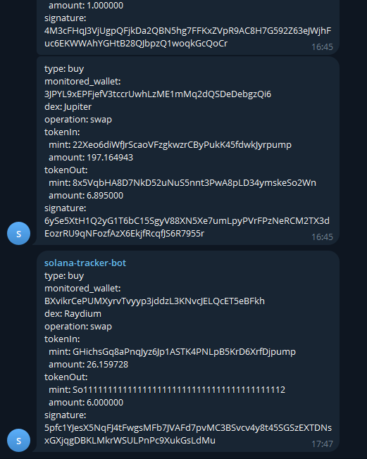

# 🎯 Solana DEX Transaction Tracker

This project is a simplified version inspired by [HandiCat](https://github.com/DracoR22/handi-cat_wallet-tracker) by DracoR22. Thank you for the inspiration and the great work.

## 📸 Demo



## ✨ Features

- Real-time monitoring of specified wallet addresses
- Transaction detection for Jupiter, Raydium, and Pump.fun DEXs
- Detailed transaction parsing including:
  - Transaction type (buy/sell/mint)
  - Token amounts and addresses
  - Operation details
  - Transaction signatures
- Telegram bot integration for instant notifications

## 🔧 Technical Details

- Uses Solana Web3.js for blockchain interaction
- Implements real-time transaction monitoring via Solana's onLogs subscription
- Parses transaction data to extract relevant swap/mint information
- Formats and sends notifications through Telegram bot API

## ⚡ Requirements
- Node.js
- Telegram Bot API Token

## 🛠️ Setup

1. Clone repo

``` git clone https://github.com/Simoblaster/solana-tracker.git ```

2. Install dependencies

``` npm install ```

3. Configure environment variables:

Copy ``` .env.example ``` to ``` .env ```  
Update the values in .env according to your setup
```
TELEGRAM_BOT_TOKEN=xxx        # Your Telegram bot token from BotFather
ADMIN_CHAT_ID=xxx             # Your Telegram chat ID to receive notifications
DISABLE_TELEGRAM_MESSAGES=0   # Set to 1 to disable Telegram notifications
```

4. Change wallets to track (optional)  
Go to ``` server.js ``` and add/remove the wallets you want to track in the ``` TRACKING_WALLETS  ``` array

5. Run the project

``` npm start ```

## 📫 Contact

- X: [@Simoblaster](https://x.com/simoblaster)
- Email: saturno.simone@gmail.com

If you find this project useful, feel free to support:
`Solana wallet`
`AQpMiPhc8eBoU6jy9FKqUb5QK4VfwVt69yiFuZLTCozq`